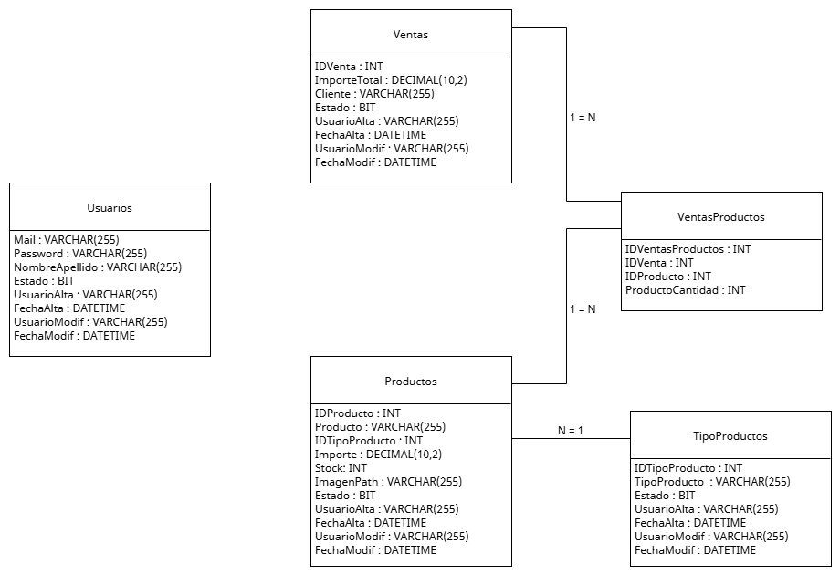
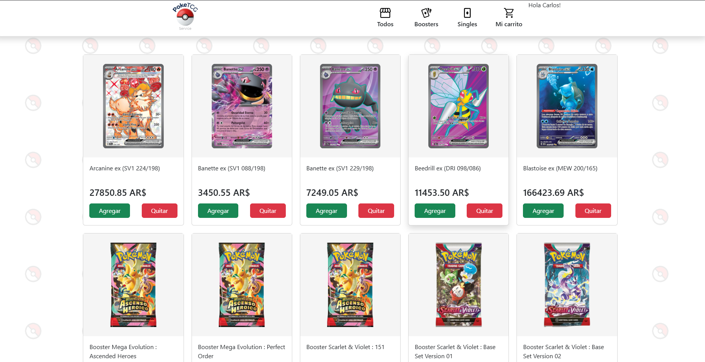

# UPDATE 2026.06.08

## Base de Datos

- Diagrama Entidad Relacion

*( Entiendo que el **Usuario Cliente** solo debe cargar su **Nombre** en la pantalla de **Bienvenida**. Estimo no tiene registro de Usuario. Por eso solo lo guardo en **Ventas.Cliente** )*

- En **./back/api/config/database/seed.sql** arme un script con la estructura del diagrama y unos insert iniciales (Tipos de Productos y los Productos que usaba para la pantalla de Productos )

- Una vez tengas abiertos **XAMPP**, y con **APACHE** y **MySQL** starteadas, en **phpMyAdmin**, solapa **SQL**, podes pegar el script de **seed.sql**, les das a **Continuar**, y te crea la base 👌🏻

## BackEnd
- Con la base creada, para levantar el Servidor, hay que ir a **/back** y desde la terminar tirar **npm start**

- Si no tiro ningun error, podes probar el unico endpoint que existe hasta el momento: **http://localhost:3000/api/productos**. Te deberia devolver un JSON con el contenido de la tabla Productos 👌🏻

## FrontEnd
- Con la base creada y el servidor andando, la pantalla del front que hasta ahora carga el unico endpoint es **/front/pages/productos.html**. Si todo esta joya, te va a cargar esta hermosura ah 👌🏻

